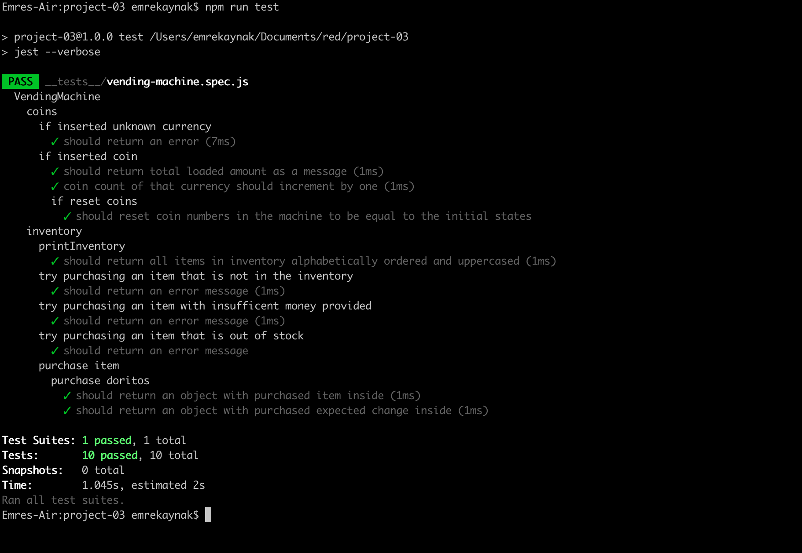

# Coding Interview project

## Description

A javascript class to implement a Vending Machine algorith and series of tests to check if the algorithm functions as intended.

## Technologies Used

- VSCode
- Git/GitHub
- Javascript
- Npm
- Jest

## How to Run

### Test Results

- Download zip file or clone repo.
- Run npm install in the root directory.
- Run the command 'npm run test'.

## Author

Emre Kaynak (LinkedIn: www.linkedin.com/in/emre-kaynak-1381a6168)

## Personal Experience

This was my first time experiencing what test-driven develepment and behavious driven-development processes look like. Implementing an algorithm in this fashion made me realize thinking and considering test cases before implementing not only make me save time because it gives me a better understanding of what exactly I am implementing, how it should function and what I should be doing while coding for it, but also made my code much more error proof.