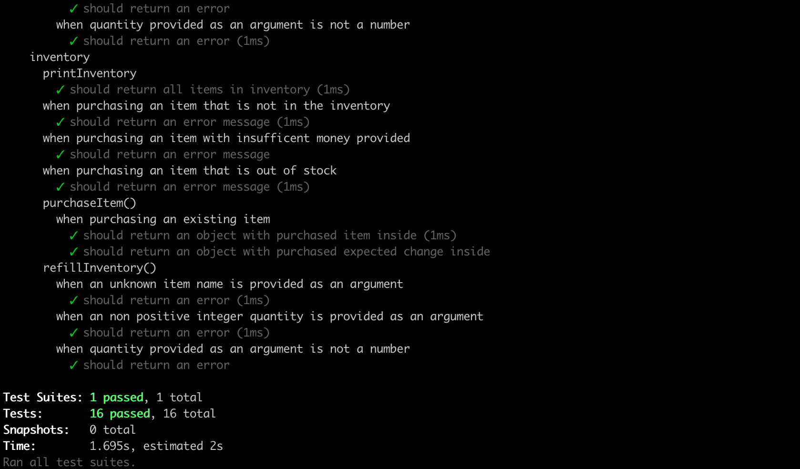

# Coding Interview project

## Description

A javascript class to implement a Vending Machine algorithm and series of tests to check if the algorithm functions as intended.

## Technologies Used

- Javascript
- Jest

## How does the Vending Machine Work?

- A new instance of Vending Machine object can be created from the VendingMachine class with new VendingMachine(initialState).
- User can insert a coin using method insert coin and passing in an argument of coin type(toonies,loonies,quarters,dimes,nickels). Attemping to insert any other type of coin results in an error.
- Loaded property within the object keeps track of the total value of the coins inserted by the user up until that point.
- Print Inventory gives a list of items currenlty available within the vending machine.
- After purchasing an item, an object is returned including the name of the item that has been returned and a change object that describes how many coins have been returned as change.
- Change propery has an object that has 'the coin type name: number of such coins return' as key value pairs. It is expected to return least amount of coins possible by prioritizing returning larger valued coins first. If there are no coins left inside the machine small enough to return the full amount needed, then tough luck for the user it only returns as much as it has available in its inventory as any vending machine.
- ResetInventory and resetCoins can be used to reset the state of the inventory and coins inside the machines to a state provided in a json format.

### Test Results



## How to Run

- Download zip file or clone repo.
- Run the following commands in the root directory.

```bash
npm install
```

```bash
npm run test
```

## Author

Emre Kaynak (LinkedIn: www.linkedin.com/in/emre-kaynak-1381a6168)

## Personal Experience

This was my first time experiencing what test-driven develepment and behaviour driven-development processes look like. Implementing an algorithm in this fashion made me realize thinking and considering test cases before implementing not only made me save time because it gave me a better understanding of what exactly I am implementing and how it should function, but also made my code much more error proof.
